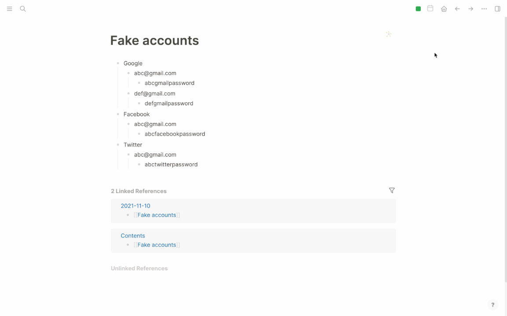

# logseq-plugin-lock

A solution to use Logseq to storage accounts and passwords safely.

## Features

* Lock any Logseq block.
* The locked info is short and invisible but still there.
* Use different icon for different lock for fun.
## Encryption design

I use [stegcloak](https://github.com/KuroLabs/stegcloak) to do the encryption job. `stegcloak` can convert your info to encrypted and invisible chars, so the encrypted string seems to be short.

You can not decrypt your original Logseq block info back, but only  unlock the info to clipboard, so you can paste it to where you want to use, may be a website's login panel or a notebook to see what the unlocked info is.

## CAUTION

**Once locked, your data cannot be restored, it can only be unlocked with your password and placed into the system clipboard. Please make sure that your clipboard is safe. If you forget your password, you will lose your info forever!!!**

## Licence

MIT
